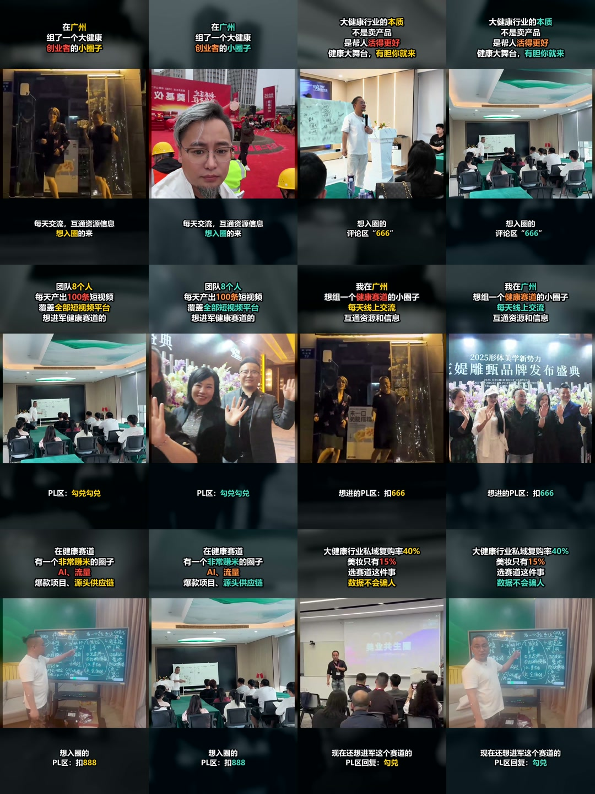

# Script to Matrix Video

一个面向中文矩阵引流内容的 Codex Skill，输出可直接发布的 9:16 MP4。

当前版本：`v1.4.0`

## 两个独立功能

### 1. 文案一键成片

输入完整客户文案，自动完成全文理解、语义分镜、素材检索、AI 图片补缺、可选阿里云 CosyVoice 配音、字幕、音效、BGM、转场、首帧封面和最终 MP4 渲染。

### 2. `text-media-text` 模板成片

输入上方标题和下方副标题/CTA，生成“上文字—中素材—下文字”的竖屏视频。默认无配音，支持单条、多版本和批量生成，并记录批次与单条耗时。

模板成片只允许使用客户素材或素材库中状态为“可使用”的图片和视频，禁止 AI 生成素材。没有合适素材时返回 `material_missing`，不会使用无关素材填充。

## 模板案例视频

仓库内置 6 组文案、每组 A/B 两个版本，共 12 条已经生成的 `text-media-text` 模板案例视频。全部为 1080×1920 H.264 MP4，单条约 10.5–12 秒。



- [查看案例文案与 A/B 视频索引](script-to-matrix-video/references/template-examples.md)
- [打开案例视频目录](script-to-matrix-video/assets/examples/text-media-text/)

案例只用于展示成片效果和校准布局，不会作为新客户视频的素材重复使用。

## 素材库能力

Skill 可以连接本地或 SSH 素材库，完成：

- 索引读取和状态统计；
- 按完整文案语义检索图片、视频和 BGM；
- 只选择状态为“可使用”的记录；
- 将选中素材复制到当前视频项目；
- 保存素材库 `record_id` 和来源路径。

连接参数可以来自命令行、`MATRIX_MATERIAL_LIBRARY_*` 环境变量，或个人配置文件：

```text
~/.codex/script-to-matrix-video/material-library.json
```

个人配置只保存主机别名、用户名和素材库目录。密码、SSH 私钥、API 密钥和素材文件不会进入 Skill 或仓库。配置方式见 [安装说明](INSTALL.md)。

## Windows 安装

```powershell
git clone https://github.com/kong74007-ui/script-to-matrix-video.git
cd script-to-matrix-video
powershell -ExecutionPolicy Bypass -File .\install.ps1
```

覆盖旧版本并保留时间戳备份：

```powershell
powershell -ExecutionPolicy Bypass -File .\install.ps1 -Force
```

安装完成后重启 Codex。

## 运行环境

- Python 3.10+
- FFmpeg 和 FFprobe
- 阿里配音需要本机环境变量 `DASHSCOPE_API_KEY`
- 远程素材库需要 OpenSSH 和已授权的 SSH 密钥
- AI 图片能力只用于文案一键成片，不用于模板成片

## 使用示例

文案一键成片：

```text
使用 $script-to-matrix-video 的“文案一键成片”功能，把下面文案制作成9:16矩阵视频，优先使用素材库，BGM自动，直接输出MP4：……
```

模板批量成片：

```text
使用 $script-to-matrix-video 的“模板成片”批量功能，提取这些截图中的文案，每条生成2个版本；只使用客户素材或素材库素材，禁止AI生成；不要配音，BGM自动，并记录总时间和单条耗时。
```

更完整的功能边界和输入格式见 [功能介绍](功能介绍.md)。

## 仓库结构

```text
script-to-matrix-video/   Skill 本体
  assets/examples/        12条模板案例视频与预览图
install.ps1               Windows 安装器
INSTALL.md                完整安装与连接配置
功能介绍.md               两个独立功能的说明
```
