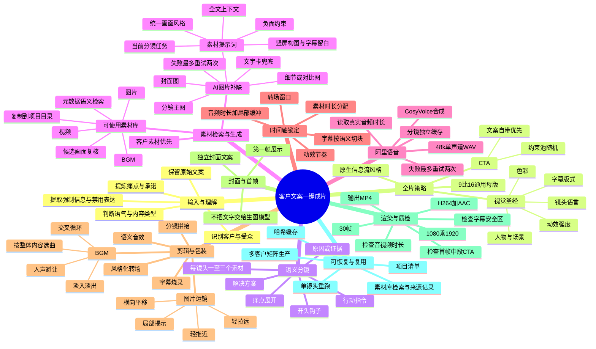

# Complete production workflow

Use this reference when planning or running a full video job.

## Stage gates

| Gate | Must be true before continuing |
|---|---|
| Copy analysis | Audience, pain point, promised value, tone, and CTA policy are explicit |
| Storyboard | Every source-copy idea is represented and each scene has one narrative function |
| Material resolution | Every selected library record is `可使用`, has been visually checked, and is copied into the project; missing scenes have an AI-generation plan |
| Visual generation | A global visual bible exists and each generated scene prompt inherits it |
| Timing lock | With narration, every scene has a successfully probed audio duration; without narration, every scene has a positive explicit duration |
| Render | Images/videos, audio, optional BGM, caption chunks, motion, and transition values resolve to local files or allowed defaults |
| Delivery | Final MP4 probes successfully; opening, middle, CTA, contextual relevance, and audio balance spot checks pass |

## Resume logic

Resume from the first failed or stale artifact. An artifact is stale when its input hash no longer matches the copy, prompt, voice settings, or render settings recorded in the manifest. Do not discard unaffected scenes.
